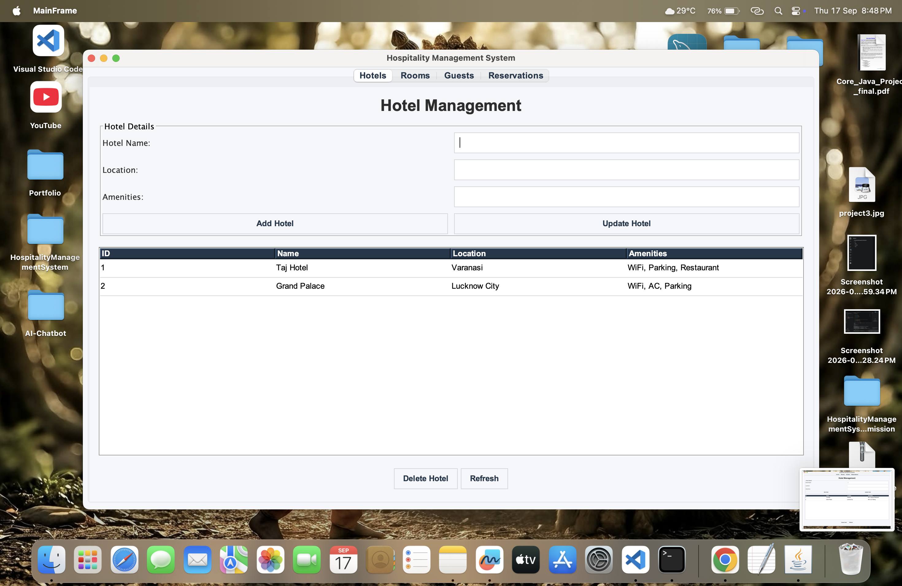
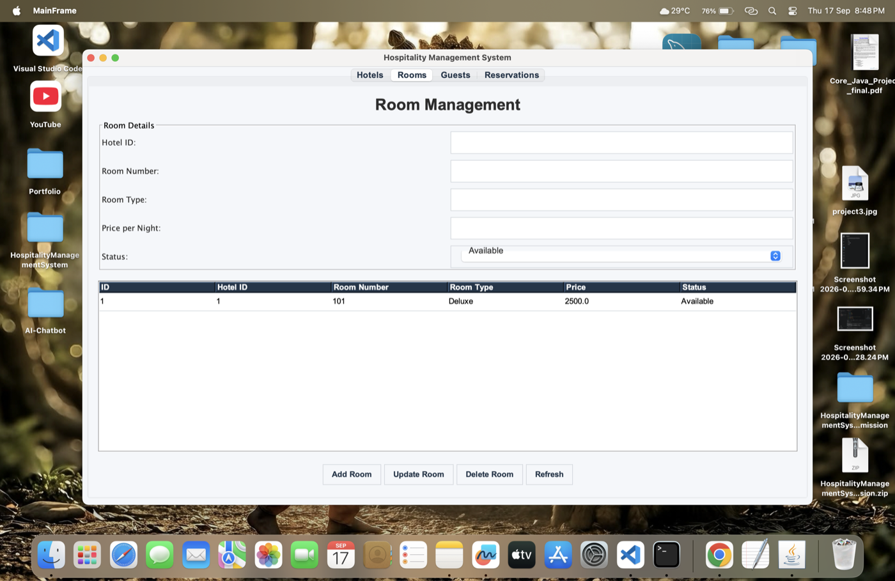
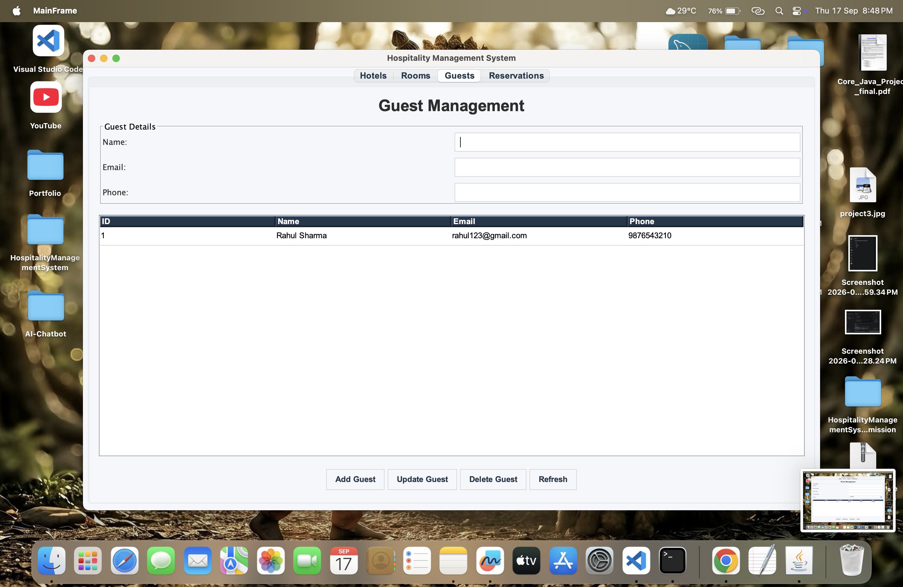
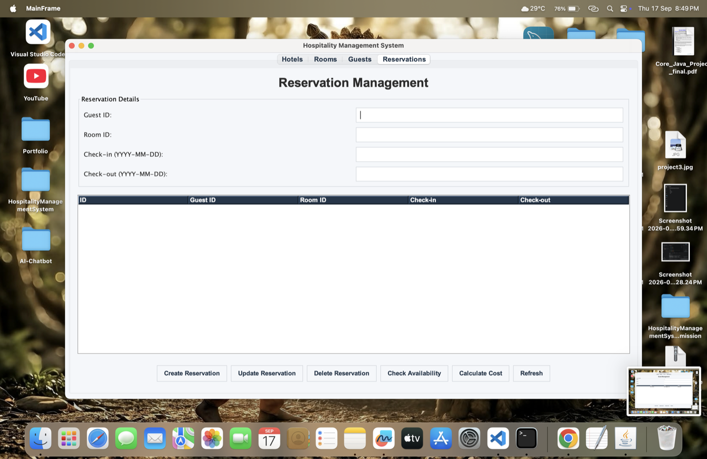

x

# Hospitality Management System

A Java Swing-based desktop application designed to manage hotels, rooms, guests, and reservations efficiently.

## Project Highlights

- User-friendly Java Swing interface
- Complete hotel and room management
- Guest record management
- Reservation booking and updating
- Room availability checking
- Automatic reservation cost calculation
- MySQL database integration
- DAO-based project architecture

## Features

### Hotel Management

- Add hotels
- Update hotel details
- Delete hotels
- View hotel records

### Room Management

- Add rooms
- Update room details
- Delete rooms
- View room records

### Guest Management

- Add guests
- Update guest details
- Delete guests
- View guest records

### Reservation Management

- Create reservations
- Update reservations
- Delete reservations
- Check room availability
- Calculate reservation cost
- View reservation details

## Technologies Used

- Java
- Java Swing
- MySQL
- JDBC
- DAO Architecture
- Visual Studio Code

## Project Structure

- `src/`
  - `dao/`
  - `gui/`
  - `model/`
  - `util/`
- `lib/`
  - MySQL Connector/J
- `.vscode/`
- `HospitalityManagementSystem.jar`
- `README.md`

## Future Improvements

- User authentication and login system
- Admin dashboard
- Online room booking
- Payment integration
- Email confirmation for reservations
- Report generation
- Improved user interface

## License

This project is created for educational and portfolio purposes.

## Screenshots

### Hotels

### Rooms

### Guests

### Reservations

